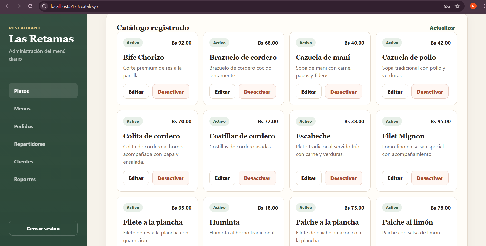
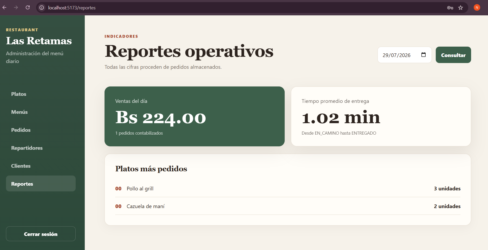
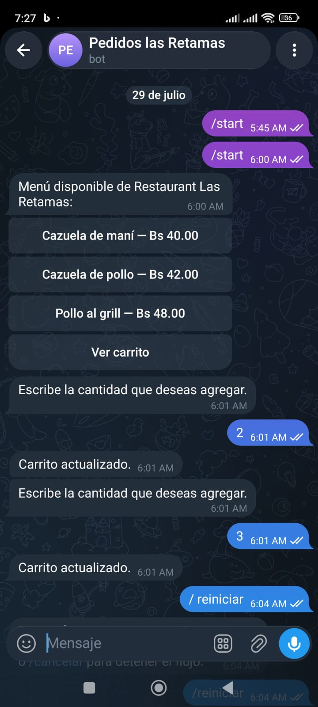
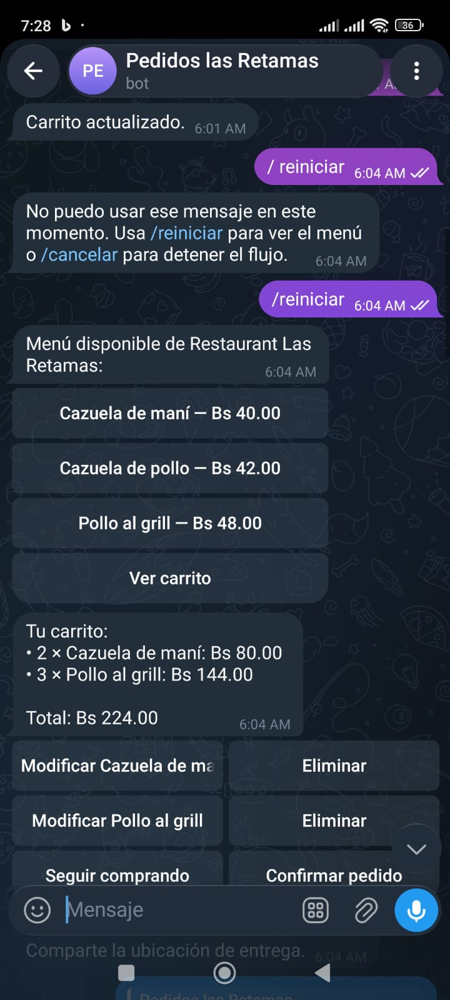

# Restaurant Las Retamas — Chatbot de pedidos

MVP académico para gestionar pedidos de Restaurant Las Retamas mediante un bot
de Telegram y un panel web administrativo. Ambos componentes utilizan una API
REST y una base de datos común, por lo que el menú, el stock, los pagos, las
asignaciones y los estados del pedido se mantienen integrados.

## Componentes

- **Bot de Telegram:** atiende al cliente y al repartidor mediante flujos
  diferenciados.
- **API REST:** concentra la autenticación, las reglas del negocio y el acceso a
  los datos.
- **Panel administrativo:** gestiona platos, menús, pedidos, pagos,
  repartidores, seguimiento, clientes y reportes.
- **PostgreSQL:** conserva la información operativa y el historial del sistema.

## Tecnologías

| Componente | Tecnología |
|---|---|
| Backend y bot | Python 3.12 |
| API REST | FastAPI 0.139 |
| Bot de Telegram | Aiogram 3.24 |
| Persistencia | PostgreSQL 15, SQLAlchemy 2.0 y Alembic 1.18 |
| Seguridad | Argon2id y JSON Web Token |
| Panel web | Vue 3.5, Vue Router 4.5 y Vite 7 |
| Mapas | Leaflet 1.9 y OpenStreetMap |
| Pruebas | `unittest` y Vitest |

Las razones de selección y las alternativas evaluadas se encuentran en
[docs/decisiones-tecnicas.md](docs/decisiones-tecnicas.md).

## Requisitos previos

- Git.
- Python 3.12.
- PostgreSQL 15 con el servicio iniciado.
- Node.js 22 y pnpm 11.
- Una cuenta de Telegram.
- Un bot creado mediante la cuenta verificada `@BotFather`.

La preparación descrita a continuación corresponde al entorno local validado en
Windows con PowerShell.

## Variables de entorno

El backend utiliza un archivo local `backend/.env`, creado a partir de
`backend/.env.example`. El frontend utiliza `frontend/.env` cuando se requiere
sobrescribir su configuración. Los archivos `.env` están excluidos de Git.

| Variable | Componente | Propósito |
|---|---|---|
| `APP_ENV` | Backend | Identifica el entorno: `development`, `test` o `production`. |
| `DATABASE_URL` | Backend | Cadena de conexión asíncrona a PostgreSQL. |
| `TELEGRAM_BOT_TOKEN` | Bot | Token secreto entregado por BotFather. |
| `JWT_SECRET` | Backend | Secreto de al menos 32 caracteres para firmar tokens. |
| `MEDIA_ROOT` | Backend | Directorio persistente de comprobantes y evidencias. |
| `PAYMENT_QR_PATH` | Backend | Ruta de la imagen QR utilizada para el pago. |
| `VITE_API_BASE` | Frontend | Prefijo o URL base de la API REST. |

No deben publicarse tokens, contraseñas, secretos JWT, chat IDs, teléfonos,
ubicaciones precisas ni comprobantes reales.

## Crear el bot con BotFather

1. Abrir Telegram y buscar la cuenta verificada `@BotFather`.
2. Enviar `/newbot`.
3. Indicar el nombre visible del bot.
4. Elegir un nombre de usuario disponible que termine en `bot`.
5. Copiar el token recibido.
6. Guardarlo en `TELEGRAM_BOT_TOKEN` dentro de `backend/.env`.
7. Revocar y reemplazar el token desde BotFather si llega a exponerse.

## Instalación local

Desde la raíz del repositorio, preparar el backend:

```powershell
cd backend
py -3.12 -m venv .venv
.\.venv\Scripts\Activate.ps1
python -m pip install --upgrade pip
python -m pip install -e ".[test]"
python -m app.cli.bootstrap_local
```

El asistente configura la base `restaurant_las_retamas`, genera
`backend/.env` y ejecuta las migraciones. A continuación, crear o actualizar un
administrador local:

```powershell
python -m app.cli.create_admin --username admin_prueba
```

La contraseña se solicita de manera oculta. La imagen QR autorizada debe
guardarse en `backend/var/payment-qr.png` o en la ruta configurada mediante
`PAYMENT_QR_PATH`.

Preparar el panel:

```powershell
cd ..\frontend
pnpm install
```

## Ejecución

Abrir tres terminales. En la primera:

```powershell
cd backend
.\.venv\Scripts\Activate.ps1
python -m uvicorn app.main:app --reload
```

En la segunda:

```powershell
cd backend
.\.venv\Scripts\Activate.ps1
python -m app.bot.run
```

En la tercera:

```powershell
cd frontend
pnpm dev
```

Servicios locales:

- Panel: `http://localhost:5173`
- API: `http://127.0.0.1:8000`
- Salud de la API: `http://127.0.0.1:8000/api/health`

La guía ampliada está en
[docs/ejecucion-local.md](docs/ejecucion-local.md).

## Pruebas

Backend:

```powershell
cd backend
.\.venv\Scripts\python.exe -m unittest discover -s tests -v
```

Frontend:

```powershell
cd frontend
pnpm test
pnpm build
```

La validación integral realizada y sus resultados se documentan en
[docs/validacion-integral.md](docs/validacion-integral.md).

## Capturas

### Panel administrativo





### Bot de Telegram





Las capturas proceden de la prueba local y fueron seleccionadas para no publicar
nombres, identificadores, teléfonos, tokens, ubicaciones ni comprobantes.

## Manuales

- [Manual del cliente](docs/manual-cliente.md)
- [Manual del repartidor](docs/manual-repartidor.md)
- [Manual del administrador](docs/manual-administrador.md)

## Documentación

- [Contexto del proyecto](docs/contexto-proyecto.md)
- [Requisitos e historias de usuario](docs/requisitos.md)
- [Diseño y diagramas](docs/diseno.md)
- [Flujo conversacional](docs/flujo-conversacional.md)
- [Máquina de estados](docs/estados-pedido.md)
- [Metodología de desarrollo](docs/metodologia-desarrollo.md)
- [Decisiones técnicas](docs/decisiones-tecnicas.md)
- [Manual de despliegue](docs/despliegue.md)
- [Registro de uso de IA](docs/uso-ia.md)
- [Declaración de autoría](docs/declaracion-autoria.md)

## Limitaciones conocidas

- La comprobación del pago es manual y la confirma una persona desde el panel.
- El MVP opera con uno o dos repartidores registrados; no implementa una cola
  automática de asignación.
- El comando de entrega por código está disponible como alternativa de prueba;
  la entrega también puede documentarse mediante fotografía.
- La detección de pérdida de señal depende del tiempo transcurrido desde la
  última ubicación recibida.
- La ejecución ha sido validada localmente. El VPS de Hetzner es el entorno
  objetivo y no debe considerarse desplegado mientras no se complete y
  verifique su procedimiento.

## Flujo de contribución

El proyecto utiliza `main` como rama estable, `develop` como rama de integración
y ramas de trabajo vinculadas a Issues y Pull Requests. Las reglas completas
están en [CONTRIBUTING.md](CONTRIBUTING.md).
