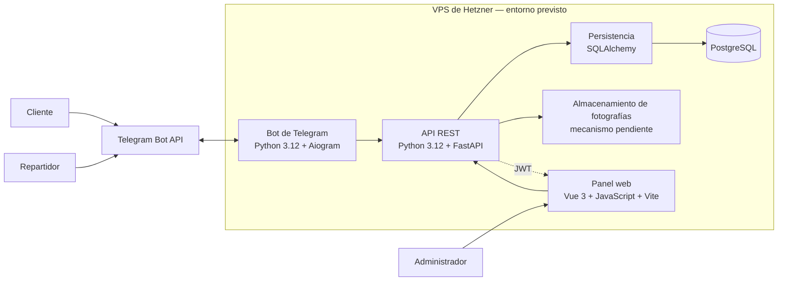
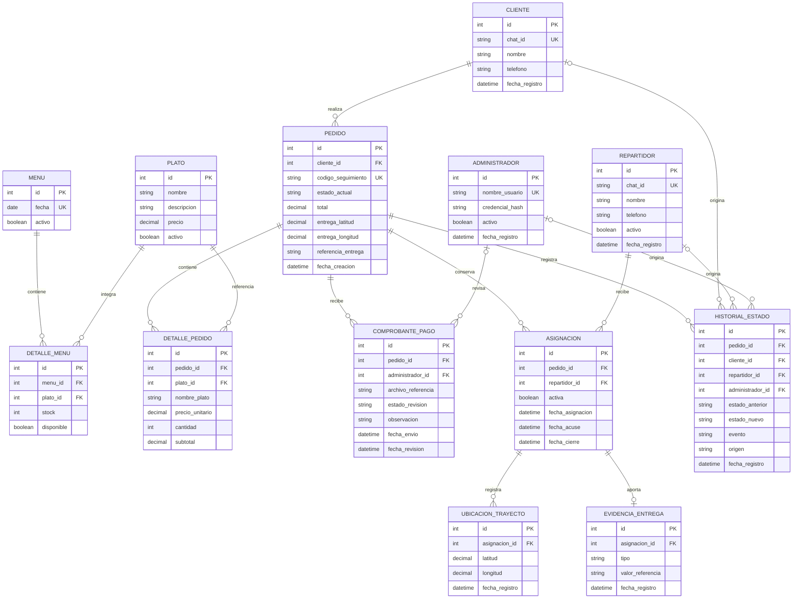

# Diseño del sistema

## Estado del documento

Este documento se construirá gradualmente. Los componentes, casos de uso y
modelo de datos descritos corresponden al diseño previsto para el MVP de
Restaurant Las Retamas. Todavía no se presentan como implementados o
desplegados.

## Principios de la arquitectura

La solución estará formada por un bot de Telegram, una API REST, un panel web y
una base de datos compartida. La API centralizará las reglas del negocio para
evitar que el bot y el panel adopten comportamientos contradictorios.

La arquitectura seguirá estas reglas:

- existirá una sola base de datos;
- existirá una sola máquina de estados del pedido;
- FastAPI centralizará las reglas de negocio;
- el bot y el panel consumirán la misma lógica;
- el bot y el panel no accederán directamente a PostgreSQL;
- SQLAlchemy concentrará la interacción del backend con la base de datos;
- las operaciones administrativas estarán protegidas;
- Telegram Bot API será tratado como un servicio externo;
- el VPS de Hetzner será un entorno objetivo, no un despliegue ya realizado.

## Bot de Telegram

### Tecnologías

- Python 3.12;
- Aiogram.

### Responsabilidades

El bot será responsable de:

- recibir mensajes y actualizaciones de Telegram;
- identificar al cliente o repartidor;
- presentar comandos, menús y botones;
- recibir cantidades, ubicaciones y fotografías;
- procesar actualizaciones de `live location`;
- enviar el QR y las notificaciones;
- transformar las interacciones de Telegram en solicitudes hacia la API.

El bot no accederá directamente a PostgreSQL ni mantendrá una máquina de estados
independiente. Las decisiones que alteren datos o estados deberán validarse por
la lógica central.

## API REST

### Tecnologías

- Python 3.12;
- FastAPI;
- SQLAlchemy.

### Responsabilidades

La API será responsable de:

- centralizar las reglas del negocio;
- validar las transiciones del pedido;
- controlar la disponibilidad y el stock;
- administrar clientes, platos, menús y pedidos;
- gestionar pagos, asignaciones y seguimiento;
- validar permisos;
- proporcionar datos al bot y al panel;
- acceder a PostgreSQL mediante SQLAlchemy.

La API constituye el punto común entre los canales del sistema. Una regla como
la confirmación manual del pago, el descuento de stock o la reasignación deberá
producir el mismo resultado sin importar desde qué interfaz se consulte
posteriormente.

## Panel web administrativo

### Tecnologías

- Vue 3;
- JavaScript;
- Vite.

### Responsabilidades

El panel permitirá:

- presentar las interfaces administrativas;
- iniciar y cerrar la sesión del administrador;
- consumir la API REST;
- gestionar platos, menús y stock;
- consultar pedidos y comprobantes;
- confirmar pagos;
- asignar y reasignar repartidores;
- mostrar el seguimiento y los reportes.

El panel no accederá directamente a PostgreSQL. Todas las consultas y cambios
serán solicitudes a la API.

## Autenticación administrativa

JSON Web Token (JWT) será el mecanismo previsto para proteger el acceso al
panel. El flujo general será:

1. el administrador envía sus credenciales a la API;
2. la API valida las credenciales almacenadas de forma segura;
3. si son correctas, entrega un token firmado;
4. el panel incluye el token en las solicitudes protegidas;
5. la API rechaza tokens inválidos o vencidos.

Este incremento no define todavía la duración, renovación o revocación de los
tokens. Esas reglas deberán decidirse y documentarse antes de implementar la
autenticación.

## Persistencia

### Tecnologías

- PostgreSQL;
- SQLAlchemy.

PostgreSQL almacenará la información persistente necesaria para representar:

- clientes;
- repartidores;
- administradores;
- platos y menús;
- pedidos y sus detalles;
- pagos y comprobantes;
- estados y eventos;
- asignaciones;
- ubicaciones;
- evidencias.

Esta enumeración identifica responsabilidades de persistencia, pero no define
tablas ni cardinalidades. SQLAlchemy representará los modelos de persistencia y
gestionará la comunicación del backend con PostgreSQL.

## Telegram Bot API

Telegram Bot API es un servicio externo a la aplicación. Permitirá:

- transportar mensajes y comandos;
- entregar `callback queries`;
- transportar objetos `Location`;
- entregar actualizaciones de `live location`;
- recibir fotografías;
- enviar el QR y las notificaciones.

Aiogram gestionará la integración del bot con esta API y enviará las operaciones
de negocio al backend central.

## Evidencias y fotografías

Los comprobantes de pago y las evidencias de entrega requieren almacenamiento
persistente. El mecanismo concreto todavía no está seleccionado.

Las alternativas que deberán evaluarse son:

- sistema de archivos del VPS;
- almacenamiento de objetos;
- identificadores de archivos de Telegram;
- una combinación de las opciones anteriores.

La selección se registrará en `docs/decisiones-tecnicas.md`. Este documento no
afirma que alguna alternativa ya haya sido implementada.

## Diagrama de componentes



El diagrama representa una organización lógica prevista. No implica que todos
los procesos deban ejecutarse en un único servicio ni que el VPS ya esté
configurado.

## Flujos entre componentes

### Flujo del cliente

```text
Cliente
→ Telegram Bot API
→ Bot Aiogram
→ API FastAPI
→ reglas de negocio
→ SQLAlchemy
→ PostgreSQL
```

La respuesta recorre el camino inverso hasta llegar al cliente mediante
Telegram.

### Flujo administrativo

```text
Administrador
→ Panel Vue
→ API FastAPI con JWT
→ reglas de negocio
→ SQLAlchemy
→ PostgreSQL
```

Cuando una acción administrativa requiere notificar a un cliente o repartidor,
la API comunica el evento al componente responsable del bot, que utiliza
Telegram Bot API para entregar la notificación.

### Flujo de ubicación

```text
Live location de Telegram
→ Bot Aiogram
→ API FastAPI
→ validación de la asignación
→ PostgreSQL
→ consulta desde el panel
→ mapa administrativo
```

El proveedor concreto del mapa todavía no está seleccionado y deberá evaluarse
antes de implementar esta visualización.

## Entorno objetivo

El sistema está previsto para desplegarse en un servidor VPS de Hetzner. El
entorno alojará los componentes que se definan en el diseño de despliegue, pero
este Issue no determina todavía procesos, contenedores, proxy, dominio,
certificados o políticas de respaldo.

La configuración reproducible se desarrollará en `docs/despliegue.md` y la
justificación de las decisiones se registrará en
`docs/decisiones-tecnicas.md`.

## Diagrama de casos de uso

El siguiente diagrama delimita las interacciones previstas entre los tres roles
del MVP y el sistema de pedidos de Restaurant Las Retamas. Los casos representan
capacidades requeridas, no funciones ya implementadas.


### Interpretación por actor

El cliente interactuará con el bot para mantener sus datos básicos, consultar
la oferta disponible y preparar el carrito. Al confirmar un pedido, compartirá
la ubicación de entrega, recibirá el QR, remitirá el comprobante y podrá
consultar el avance. La solicitud de cancelación estará sujeta a las
transiciones permitidas en `docs/estados-pedido.md`.

El repartidor utilizará el bot después de autenticarse. Solo recibirá pedidos
asignados por el administrador; deberá confirmar su recepción, compartir
`live location` durante el trayecto, registrar la llegada y aportar una
evidencia válida para completar la entrega.

El administrador accederá al panel protegido para mantener platos, menú,
disponibilidad y stock; revisar pedidos y comprobantes; validar pagos; asignar o
reasignar repartidores; supervisar las ubicaciones; y consultar información de
clientes, historial y reportes básicos.

### Relaciones entre los casos

Aunque el diagrama agrupa las interacciones por actor, los tres flujos comparten
la lógica central. La confirmación manual del pago habilita la preparación y
posterior asignación; la asignación vincula al repartidor con el pedido; y los
eventos de trayecto, llegada y entrega actualizan el estado que consulta el
cliente y supervisa el administrador.

Los permisos, validaciones y cambios de estado se aplicarán en la API conforme
a la máquina común definida en `docs/estados-pedido.md`. El orden conversacional
detallado permanece documentado en `docs/flujo-conversacional.md`.

## Modelo entidad-relación

El modelo representa la información que deberá persistir el MVP. Sus entidades,
atributos y cardinalidades constituyen un diseño conceptual: no equivalen
todavía a tablas creadas, migraciones ejecutadas ni modelos SQLAlchemy
implementados.



### Entidades del catálogo y el menú

`PLATO` conserva el catálogo administrable, mientras que `MENU` representa la
oferta de una fecha. `DETALLE_MENU` resuelve la relación de muchos a muchos:
un menú puede incorporar varios platos y un plato puede aparecer en distintos
menús. La combinación de `menu_id` y `plato_id` deberá ser única para evitar
repeticiones dentro de una misma fecha.

La disponibilidad y el stock se ubican en `DETALLE_MENU` porque corresponden a
la oferta concreta de un plato en un menú. El stock no podrá ser negativo.

### Pedido y detalle confirmado

Cada `PEDIDO` pertenece a un solo cliente y debe contener al menos un
`DETALLE_PEDIDO` cuando se confirma. El detalle conserva el nombre y el precio
unitario utilizados en ese momento, además de referenciar al plato. De esta
manera, una modificación posterior del catálogo no altera el contenido
histórico del pedido.

La ubicación fija de entrega se conserva en `PEDIDO`. Es distinta de las
ubicaciones generadas durante el trayecto. El código de seguimiento debe ser
único y `estado_actual` debe corresponder a la máquina definida en
`docs/estados-pedido.md`.

### Comprobantes y revisión manual

Un pedido puede reunir varios `COMPROBANTE_PAGO`, ya que un archivo rechazado
puede ser sustituido por uno nuevo sin perder el historial. Cada comprobante
pertenece a un solo pedido y puede permanecer sin revisor mientras está
pendiente. Cuando se revisa, queda asociado como máximo a un administrador,
junto con la decisión, la observación y las fechas correspondientes.

El archivo del comprobante se representa mediante una referencia. El mecanismo
concreto para almacenar fotografías continúa pendiente de una decisión técnica.

### Asignaciones, seguimiento y entrega

`ASIGNACION` relaciona un pedido con el repartidor elegido por el administrador.
Un pedido puede acumular varias asignaciones, pero solo una podrá permanecer
activa a la vez. La asignación conserva las fechas de creación, acuse y cierre
para representar la reasignación sin eliminar el historial.

Cada `UBICACION_TRAYECTO` pertenece a una asignación, no directamente al pedido.
Así, los puntos de dos repartidores no se mezclan cuando existe una
reasignación. La fecha de cada punto permite ordenar el rastro y determinar cuál
fue la última ubicación recibida.

La `EVIDENCIA_ENTREGA` también se vincula con la asignación responsable. Una
asignación puede no tener evidencia mientras la entrega está pendiente y
registrar una cuando se completa. Su tipo permite distinguir la fotografía del
código proporcionado por el cliente. La forma definitiva de almacenar la
fotografía o proteger el código deberá resolverse antes de implementar esta
entidad.

### Historial de estados y autoría

`HISTORIAL_ESTADO` conserva el estado anterior, el nuevo estado, el evento y la
fecha. Cada registro pertenece a un pedido. El campo `origen` permite
diferenciar acciones del sistema y de los roles; las referencias opcionales a
cliente, repartidor o administrador identifican al actor cuando corresponda.
Solo una de estas referencias podrá representar al actor de un evento.

El historial es acumulativo: las transiciones no se sobrescriben ni se eliminan
cuando cambia `estado_actual`.

### Reglas de integridad previstas

- `chat_id`, `nombre_usuario`, `fecha` del menú y `codigo_seguimiento` deben ser
  únicos dentro de su ámbito.
- Las cantidades y el stock deben ser enteros no negativos; un detalle
  confirmado requiere una cantidad mayor que cero.
- Los importes monetarios deben usar precisión decimal.
- Un pedido confirmado debe conservar al menos un detalle.
- Solo una asignación de un pedido puede estar activa al mismo tiempo.
- Un comprobante pendiente puede no tener administrador ni fecha de revisión.
- Las ubicaciones y evidencias solo pueden registrarse sobre la asignación
  vigente según las reglas del negocio.
- Los estados almacenados deben pertenecer al conjunto definido en la máquina
  de estados compartida.

## Elementos pendientes del diseño

Permanecen pendientes para Issues posteriores:

- endpoints concretos;
- estructura del código;
- almacenamiento definitivo de archivos;
- proveedor del mapa;
- reglas detalladas de JWT;
- arquitectura física del despliegue.

Estos elementos deberán ser consistentes con la implementación que finalmente
se integre.
