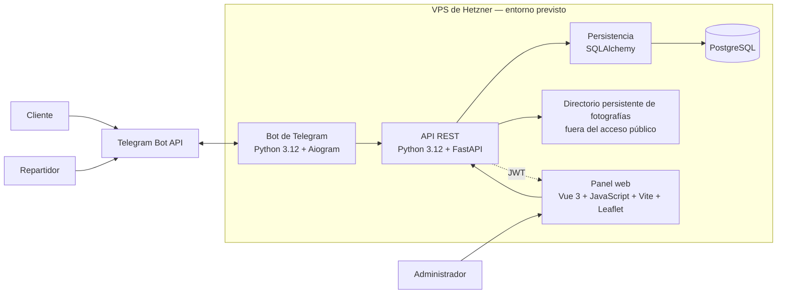
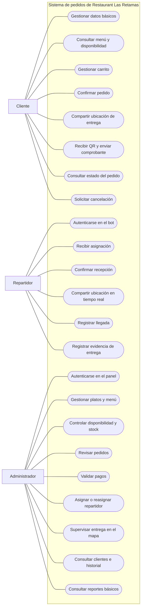
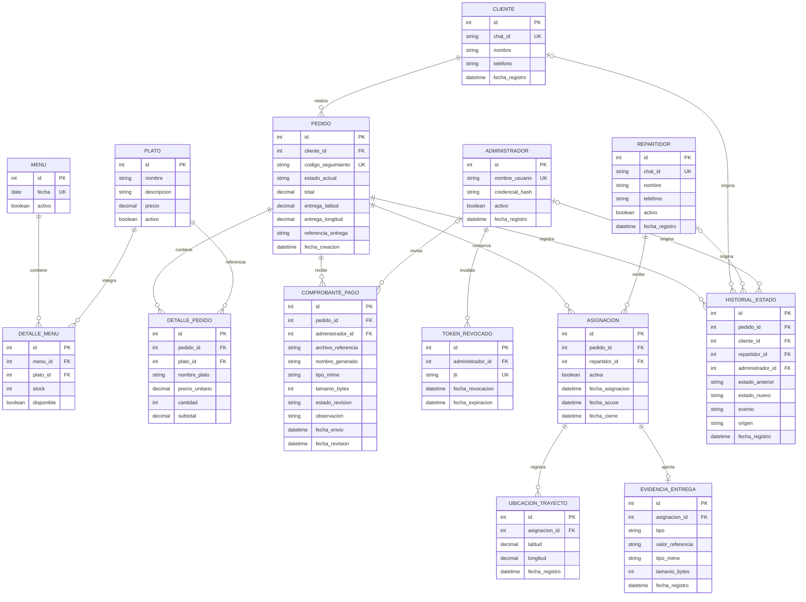

# Diseño del sistema

## Estado del documento

Este documento se construirá gradualmente. Los componentes, casos de uso y
modelo de datos descritos corresponden al diseño previsto para el MVP de
Restaurant Las Retamas. Todavía no se presentan como implementados o
desplegados.

## Principios de la arquitectura

La solución estará formada por un bot de Telegram, una API REST, un panel web y
una base de datos compartida. La API centralizará las reglas del negocio para
evitar que el bot y el panel adopten comportamientos contradictorios.

La arquitectura seguirá estas reglas:

- existirá una sola base de datos;
- existirá una sola máquina de estados del pedido;
- FastAPI centralizará las reglas de negocio;
- el bot y el panel consumirán la misma lógica;
- el bot y el panel no accederán directamente a PostgreSQL;
- SQLAlchemy concentrará la interacción del backend con la base de datos;
- las operaciones administrativas estarán protegidas;
- Telegram Bot API será tratado como un servicio externo;
- el VPS de Hetzner será un entorno objetivo, no un despliegue ya realizado.

## Bot de Telegram

### Tecnologías

- Python 3.12;
- Aiogram.

### Responsabilidades

El bot será responsable de:

- recibir mensajes y actualizaciones de Telegram;
- identificar al cliente o repartidor;
- presentar comandos, menús y botones;
- recibir cantidades, ubicaciones y fotografías;
- procesar actualizaciones de `live location`;
- enviar el QR y las notificaciones;
- transformar las interacciones de Telegram en solicitudes hacia la API.

El bot no accederá directamente a PostgreSQL ni mantendrá una máquina de estados
independiente. Las decisiones que alteren datos o estados deberán validarse por
la lógica central.

## API REST

### Tecnologías

- Python 3.12;
- FastAPI;
- SQLAlchemy.

### Responsabilidades

La API será responsable de:

- centralizar las reglas del negocio;
- validar las transiciones del pedido;
- controlar la disponibilidad y el stock;
- administrar clientes, platos, menús y pedidos;
- gestionar pagos, asignaciones y seguimiento;
- validar permisos;
- proporcionar datos al bot y al panel;
- acceder a PostgreSQL mediante SQLAlchemy.

La API constituye el punto común entre los canales del sistema. Una regla como
la confirmación manual del pago, el descuento de stock o la reasignación deberá
producir el mismo resultado sin importar desde qué interfaz se consulte
posteriormente.

## Panel web administrativo

### Tecnologías

- Vue 3;
- JavaScript;
- Vite;
- Leaflet;
- OpenStreetMap como fuente cartográfica inicial.

### Responsabilidades

El panel permitirá:

- presentar las interfaces administrativas;
- iniciar y cerrar la sesión del administrador;
- consumir la API REST;
- gestionar platos, menús y stock;
- consultar pedidos y comprobantes;
- confirmar pagos;
- asignar y reasignar repartidores;
- mostrar el seguimiento y los reportes.

El panel no accederá directamente a PostgreSQL. Todas las consultas y cambios
serán solicitudes a la API.

## Autenticación administrativa

JSON Web Token (JWT) será el mecanismo previsto para proteger el acceso al
panel. El flujo general será:

1. el administrador envía sus credenciales a la API;
2. la API valida las credenciales almacenadas de forma segura;
3. si son correctas, entrega un token de acceso firmado con `HS256`;
4. el panel conserva el token únicamente en memoria;
5. el panel lo envía como `Authorization: Bearer <token>`;
6. la API valida el token y la autorización en cada operación protegida;
7. al cerrar sesión, la API registra su `jti` como revocado hasta el
   vencimiento.

### Emisión del token

El token de acceso tendrá una duración de 15 minutos y una tolerancia temporal
máxima de 30 segundos durante la validación. El MVP no emitirá refresh tokens:
cuando el token expire o se pierda al recargar la página, el administrador
deberá autenticarse nuevamente.

El algoritmo permitido será únicamente `HS256`. El secreto tendrá al menos 256
bits generados de forma aleatoria, se obtendrá mediante configuración del
entorno y no se incluirá en el repositorio. La API no elegirá el algoritmo a
partir del encabezado recibido y rechazará tokens sin firma o con
`alg: none`.

Las claims obligatorias serán:

| Claim | Contenido previsto |
|---|---|
| `sub` | Identificador del administrador |
| `role` | Valor fijo `admin` |
| `iss` | Valor fijo `restaurant-las-retamas-api` |
| `aud` | Valor fijo `restaurant-las-retamas-panel` |
| `iat` | Momento de emisión |
| `nbf` | Momento desde el cual el token es válido |
| `exp` | Momento de vencimiento |
| `jti` | Identificador único del token |

El token no incluirá contraseñas, comprobantes, ubicaciones ni otros datos
sensibles innecesarios.

### Validación y autorización

En cada endpoint administrativo, la API deberá:

1. comprobar que el esquema recibido sea `Bearer`;
2. aceptar exclusivamente `HS256`;
3. verificar la firma con el secreto configurado;
4. validar `iss`, `aud`, `iat`, `nbf` y `exp`;
5. comprobar que `sub`, `role` y `jti` estén presentes;
6. confirmar que el rol sea `admin` y que el administrador continúe activo;
7. rechazar el token si su `jti` figura como revocado;
8. aplicar la autorización propia de la operación.

Una credencial ausente, inválida, vencida o revocada producirá una respuesta
genérica de autenticación. Una identidad válida sin permiso suficiente
producirá una respuesta de autorización, sin revelar detalles internos.

### Almacenamiento y cierre de sesión

El panel mantendrá el token solamente en memoria y no utilizará `localStorage`
ni `sessionStorage`. Esta medida reduce la persistencia del token en el
navegador, pero implica perder la sesión al recargar o cerrar la página.

El cierre de sesión eliminará la copia en memoria y enviará el token vigente a
la operación protegida de cierre. La API registrará su `jti`, el administrador,
la fecha de revocación y la expiración. La entrada podrá eliminarse después de
`exp`; nunca se almacenará el JWT completo.

Las credenciales y los tokens se transportarán únicamente mediante HTTPS. Los
errores y registros de auditoría no incluirán contraseñas, secretos ni tokens
completos.

### Protección de la contraseña

La contraseña administrativa se protegerá mediante Argon2id. Los parámetros
iniciales serán:

| Parámetro | Valor inicial |
|---|---|
| Memoria | 19 MiB (`19456` KiB) |
| Iteraciones | `2` |
| Paralelismo | `1` |

La biblioteca generará una sal aleatoria y única para cada contraseña.
`credencial_hash` conservará la cadena PHC completa, que incluye el algoritmo,
la versión, los parámetros, la sal y el resultado. No se almacenará la
contraseña en texto plano ni mediante cifrado reversible.

La verificación utilizará la función de comparación de la biblioteca. Si una
autenticación válida detecta parámetros obsoletos, se generará un nuevo hash con
la configuración vigente. Las respuestas no distinguirán entre un usuario
inexistente y una contraseña incorrecta, y el flujo deberá reducir diferencias
observables que permitan enumerar cuentas.

No se utilizará un `pepper` en el alcance inicial. Si se incorpora después,
deberá existir una nueva decisión y el secreto permanecerá fuera de PostgreSQL y
del repositorio.

Antes del despliegue, los parámetros de Argon2id deberán medirse en el VPS de
Hetzner. Podrán aumentarse si el servidor mantiene un tiempo de autenticación
aceptable; esta medición todavía no se ha realizado.

Las contraseñas y los hashes no aparecerán en JWT, logs, respuestas ni mensajes
de error. Estas reglas corresponden al diseño aprobado y todavía no están
implementadas.

## Persistencia

### Tecnologías

- PostgreSQL;
- SQLAlchemy;
- Alembic.

PostgreSQL almacenará la información persistente necesaria para representar:

- clientes;
- repartidores;
- administradores;
- platos y menús;
- pedidos y sus detalles;
- pagos y comprobantes;
- estados y eventos;
- asignaciones;
- ubicaciones;
- evidencias.

Esta enumeración identifica responsabilidades de persistencia. El modelo
conceptual y sus cardinalidades se detallan más adelante en este documento.
SQLAlchemy representará los modelos y gestionará la comunicación del backend con
PostgreSQL.

### Estrategia de migraciones

Alembic mantendrá la evolución versionada del esquema. Cada revisión se
conservará en Git e incluirá:

- identificador de revisión;
- referencia a la revisión anterior;
- descripción breve y coherente con el cambio;
- operación `upgrade()`;
- operación `downgrade()` cuando el cambio sea técnicamente reversible.

Una operación irreversible deberá declararlo y justificarlo de forma explícita.
Los cambios destructivos requerirán revisión específica y un respaldo
verificado antes de ejecutarse sobre datos compartidos.

La autogeneración comparará los metadatos de SQLAlchemy con el esquema como
punto de partida. Su resultado será un borrador: deberá revisarse para confirmar
tipos, restricciones, índices, datos y operaciones de reversión antes del
commit. Las migraciones de datos se distinguirán claramente de los cambios
estructurales.

`Base.metadata.create_all()` no sustituirá el historial de Alembic. Tampoco se
modificará manualmente el esquema de los entornos compartidos sin una revisión
versionada.

La URL de PostgreSQL se obtendrá desde la configuración del entorno. Las
credenciales no se escribirán en `alembic.ini` ni en otros archivos
versionados.

`develop` deberá conservar una sola cabeza de migraciones. Si el trabajo
paralelo produce cabezas distintas, se reconciliarán antes de integrar. Como
verificación, una base vacía deberá poder ejecutar todas las revisiones hasta
`head`.

Durante el despliegue, las migraciones se aplicarán antes de iniciar la nueva
versión de la aplicación. Esta estrategia todavía no está configurada ni ha
sido ejecutada contra una base real.

## Telegram Bot API

Telegram Bot API es un servicio externo a la aplicación. Permitirá:

- transportar mensajes y comandos;
- entregar `callback queries`;
- transportar objetos `Location`;
- entregar actualizaciones de `live location`;
- recibir fotografías;
- enviar el QR y las notificaciones.

Aiogram gestionará la integración del bot con esta API y enviará las operaciones
de negocio al backend central.

## Evidencias y fotografías

Los comprobantes de pago y las evidencias de entrega requieren almacenamiento
persistente. Para el MVP se utilizará un directorio configurable en el sistema
de archivos del VPS de Hetzner. Este directorio permanecerá fuera de los
recursos públicos del panel y no se expondrá como una carpeta de descarga
directa.

El bot descargará la fotografía recibida desde Telegram y la operación de
negocio solicitará su conservación en el almacenamiento propio. PostgreSQL no
guardará el contenido binario: conservará la ruta relativa, el nombre generado,
el tipo MIME, el tamaño, la fecha y la relación con el comprobante o la
asignación correspondiente.

Los nombres serán generados por el sistema y no incorporarán rutas ni nombres
proporcionados por el usuario. Antes de aceptar un archivo deberán comprobarse
el formato y el tamaño máximo configurado. La consulta se realizará mediante
operaciones autenticadas y autorizadas de la aplicación.

La base de datos y el directorio persistente deberán incluirse en una estrategia
coordinada de respaldo. Esta decisión se registra en
`docs/decisiones-tecnicas.md`; todavía no implica que el directorio, las
validaciones, los respaldos o las operaciones de acceso estén implementados.

## Diagrama de componentes



El diagrama representa una organización lógica prevista. No implica que todos
los procesos deban ejecutarse en un único servicio ni que el VPS ya esté
configurado.

## Flujos entre componentes

### Flujo del cliente

```text
Cliente
→ Telegram Bot API
→ Bot Aiogram
→ API FastAPI
→ reglas de negocio
→ SQLAlchemy
→ PostgreSQL
```

La respuesta recorre el camino inverso hasta llegar al cliente mediante
Telegram.

### Flujo administrativo

```text
Administrador
→ Panel Vue
→ API FastAPI con JWT
→ reglas de negocio
→ SQLAlchemy
→ PostgreSQL
```

Cuando una acción administrativa requiere notificar a un cliente o repartidor,
la API comunica el evento al componente responsable del bot, que utiliza
Telegram Bot API para entregar la notificación.

### Flujo de ubicación

```text
Live location de Telegram
→ Bot Aiogram
→ API FastAPI
→ validación de la asignación
→ PostgreSQL
→ consulta desde el panel
→ mapa administrativo
```

La visualización utilizará Leaflet y una capa inicial de teselas de
OpenStreetMap. La URL de las teselas permanecerá configurable para que la fuente
pueda sustituirse sin reescribir el componente.

## Mapa administrativo

El mapa representará únicamente el seguimiento requerido para el MVP. No
proporcionará navegación paso a paso, cálculo de rutas ni geocodificación.

La visualización prevista incluirá:

- un marcador para el destino registrado en el pedido;
- un marcador diferenciado para la última posición válida del repartidor;
- una línea formada por las ubicaciones de la asignación activa, ordenadas por
  su fecha de registro;
- la fecha y hora de la última actualización recibida;
- una advertencia cuando la ubicación supere el intervalo que se defina como
  desactualizado.

El panel obtendrá el destino y el rastro mediante la API. No consultará
PostgreSQL directamente ni enviará datos personales o ubicaciones a un servicio
de geocodificación.

### Fuente cartográfica y condiciones de uso

OpenStreetMap será la fuente cartográfica inicial para las teselas mostradas por
Leaflet. La interfaz conservará visible la atribución a sus colaboradores y no
ocultará ni reemplazará el control correspondiente.

El mapa solicitará solamente las teselas requeridas por la vista interactiva
del usuario. No ofrecerá descarga masiva, precarga de áreas ni uso sin conexión,
y respetará las directivas de caché recibidas. El servicio público de teselas no
ofrece garantía de disponibilidad; por ello, su URL no se incorporará de forma
inamovible al componente y podrá cambiarse mediante configuración.

Las condiciones vigentes deberán revisarse antes del despliegue:

- referencia de Leaflet: <https://leafletjs.com/reference>;
- política de teselas de OpenStreetMap:
  <https://operations.osmfoundation.org/policies/tiles/>.

Esta sección define el comportamiento esperado, pero Leaflet todavía no está
instalado y el componente del mapa no está implementado.

## Entorno objetivo

El sistema está previsto para desplegarse en un servidor VPS de Hetzner. El
entorno alojará los componentes que se definan en el diseño de despliegue, pero
este Issue no determina todavía procesos, contenedores, proxy, dominio,
certificados o políticas de respaldo.

La configuración reproducible se desarrollará en `docs/despliegue.md` y la
justificación de las decisiones se registrará en
`docs/decisiones-tecnicas.md`.

## Diagrama de casos de uso

El siguiente diagrama delimita las interacciones previstas entre los tres roles
del MVP y el sistema de pedidos de Restaurant Las Retamas. Los casos representan
capacidades requeridas, no funciones ya implementadas.



### Interpretación por actor

El cliente interactuará con el bot para mantener sus datos básicos, consultar
la oferta disponible y preparar el carrito. Al confirmar un pedido, compartirá
la ubicación de entrega, recibirá el QR, remitirá el comprobante y podrá
consultar el avance. La solicitud de cancelación estará sujeta a las
transiciones permitidas en `docs/estados-pedido.md`.

El repartidor utilizará el bot después de autenticarse. Solo recibirá pedidos
asignados por el administrador; deberá confirmar su recepción, compartir
`live location` durante el trayecto, registrar la llegada y aportar una
evidencia válida para completar la entrega.

El administrador accederá al panel protegido para mantener platos, menú,
disponibilidad y stock; revisar pedidos y comprobantes; validar pagos; asignar o
reasignar repartidores; supervisar las ubicaciones; y consultar información de
clientes, historial y reportes básicos.

### Relaciones entre los casos

Aunque el diagrama agrupa las interacciones por actor, los tres flujos comparten
la lógica central. La confirmación manual del pago habilita la preparación y
posterior asignación; la asignación vincula al repartidor con el pedido; y los
eventos de trayecto, llegada y entrega actualizan el estado que consulta el
cliente y supervisa el administrador.

Los permisos, validaciones y cambios de estado se aplicarán en la API conforme
a la máquina común definida en `docs/estados-pedido.md`. El orden conversacional
detallado permanece documentado en `docs/flujo-conversacional.md`.

## Modelo entidad-relación

El modelo representa la información que deberá persistir el MVP. Sus entidades,
atributos y cardinalidades constituyen un diseño conceptual: no equivalen
todavía a tablas creadas, migraciones ejecutadas ni modelos SQLAlchemy
implementados.



### Entidades del catálogo y el menú

`PLATO` conserva el catálogo administrable, mientras que `MENU` representa la
oferta de una fecha. `DETALLE_MENU` resuelve la relación de muchos a muchos:
un menú puede incorporar varios platos y un plato puede aparecer en distintos
menús. La combinación de `menu_id` y `plato_id` deberá ser única para evitar
repeticiones dentro de una misma fecha.

La disponibilidad y el stock se ubican en `DETALLE_MENU` porque corresponden a
la oferta concreta de un plato en un menú. El stock no podrá ser negativo.

### Pedido y detalle confirmado

Cada `PEDIDO` pertenece a un solo cliente y debe contener al menos un
`DETALLE_PEDIDO` cuando se confirma. El detalle conserva el nombre y el precio
unitario utilizados en ese momento, además de referenciar al plato. De esta
manera, una modificación posterior del catálogo no altera el contenido
histórico del pedido.

La ubicación fija de entrega se conserva en `PEDIDO`. Es distinta de las
ubicaciones generadas durante el trayecto. El código de seguimiento debe ser
único y `estado_actual` debe corresponder a la máquina definida en
`docs/estados-pedido.md`.

### Comprobantes y revisión manual

Un pedido puede reunir varios `COMPROBANTE_PAGO`, ya que un archivo rechazado
puede ser sustituido por uno nuevo sin perder el historial. Cada comprobante
pertenece a un solo pedido y puede permanecer sin revisor mientras está
pendiente. Cuando se revisa, queda asociado como máximo a un administrador,
junto con la decisión, la observación y las fechas correspondientes.

El comprobante conserva la referencia relativa al archivo del VPS y los
metadatos necesarios para validarlo y localizarlo. El contenido binario no se
almacena en PostgreSQL.

### Asignaciones, seguimiento y entrega

`ASIGNACION` relaciona un pedido con el repartidor elegido por el administrador.
Un pedido puede acumular varias asignaciones, pero solo una podrá permanecer
activa a la vez. La asignación conserva las fechas de creación, acuse y cierre
para representar la reasignación sin eliminar el historial.

Cada `UBICACION_TRAYECTO` pertenece a una asignación, no directamente al pedido.
Así, los puntos de dos repartidores no se mezclan cuando existe una
reasignación. La fecha de cada punto permite ordenar el rastro y determinar cuál
fue la última ubicación recibida.

La `EVIDENCIA_ENTREGA` también se vincula con la asignación responsable. Una
asignación puede no tener evidencia mientras la entrega está pendiente y
registrar una cuando se completa. Su tipo permite distinguir la fotografía del
código proporcionado por el cliente. Cuando sea una fotografía,
`valor_referencia` conservará su ruta relativa y los metadatos describirán el
archivo persistente. La forma concreta de generar y proteger el código deberá
resolverse antes de implementar esa alternativa de confirmación.

### Historial de estados y autoría

`HISTORIAL_ESTADO` conserva el estado anterior, el nuevo estado, el evento y la
fecha. Cada registro pertenece a un pedido. El campo `origen` permite
diferenciar acciones del sistema y de los roles; las referencias opcionales a
cliente, repartidor o administrador identifican al actor cuando corresponda.
Solo una de estas referencias podrá representar al actor de un evento.

El historial es acumulativo: las transiciones no se sobrescriben ni se eliminan
cuando cambia `estado_actual`.

### Reglas de integridad previstas

- `chat_id`, `nombre_usuario`, `fecha` del menú y `codigo_seguimiento` deben ser
  únicos dentro de su ámbito.
- Las cantidades y el stock deben ser enteros no negativos; un detalle
  confirmado requiere una cantidad mayor que cero.
- Los importes monetarios deben usar precisión decimal.
- Un pedido confirmado debe conservar al menos un detalle.
- Solo una asignación de un pedido puede estar activa al mismo tiempo.
- Un comprobante pendiente puede no tener administrador ni fecha de revisión.
- Las ubicaciones y evidencias solo pueden registrarse sobre la asignación
  vigente según las reglas del negocio.
- Los estados almacenados deben pertenecer al conjunto definido en la máquina
  de estados compartida.
- Cada `jti` revocado debe ser único y conservarse hasta el vencimiento del
  token correspondiente.

## Elementos pendientes del diseño

Permanecen pendientes para Issues posteriores:

- endpoints concretos;
- estructura del código;
- arquitectura física del despliegue.

Estos elementos deberán ser consistentes con la implementación que finalmente
se integre.
