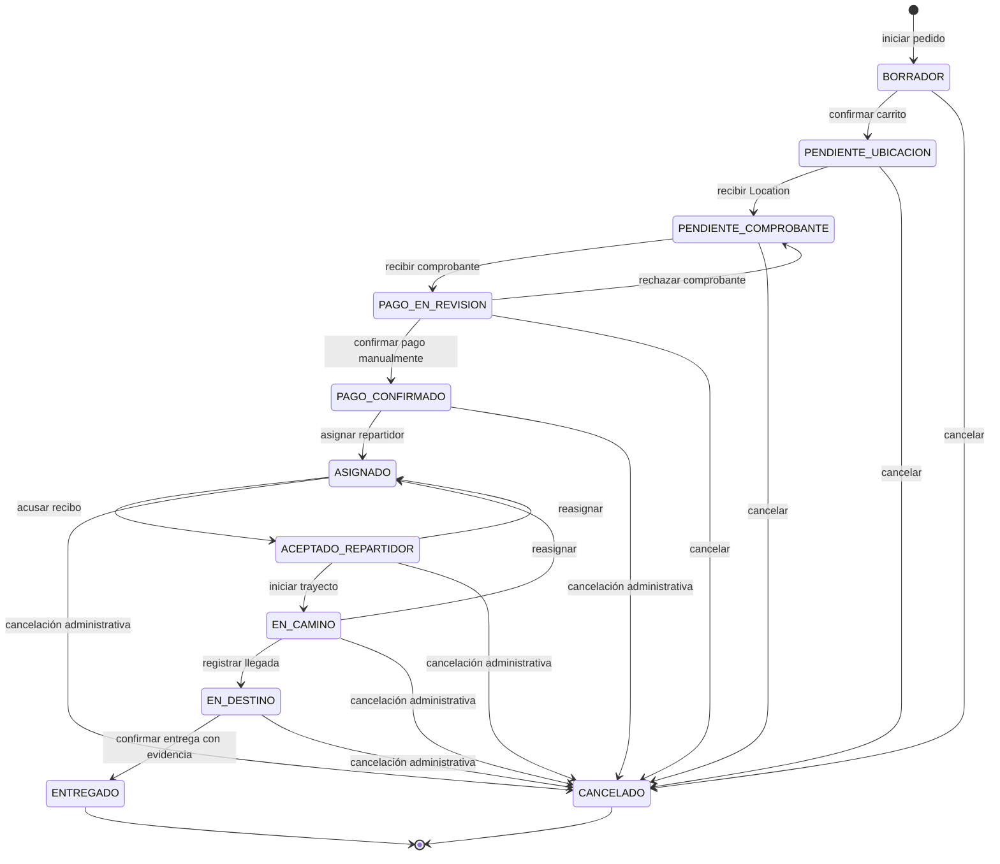

# Máquina de estados del pedido

## Propósito

Este documento define el modelo de estados previsto para coordinar el pedido
entre el bot de Telegram, el panel web y el flujo del repartidor. Los tres
componentes deberán utilizar los mismos estados y reglas de transición sobre la
base de datos compartida.

El modelo se establece antes de la implementación. Por tanto, describe el
comportamiento que deberá construirse y verificarse, pero no afirma que la
máquina de estados ya exista en el código.

## Estados

| Estado | Tipo | Propósito |
|---|---|---|
| `BORRADOR` | Inicial | El cliente conforma el carrito y todavía puede agregar, modificar o eliminar platos. |
| `PENDIENTE_UBICACION` | Intermedio | El contenido fue confirmado y se espera la ubicación de entrega. |
| `PENDIENTE_COMPROBANTE` | Intermedio | La ubicación fue registrada, se envió el QR y se espera la fotografía del comprobante. |
| `PAGO_EN_REVISION` | Intermedio | El comprobante fue recibido y espera la revisión manual del administrador. |
| `PAGO_CONFIRMADO` | Intermedio | El administrador confirmó manualmente el pago. |
| `ASIGNADO` | Intermedio | Existe un repartidor designado que todavía no realizó el acuse de recibo. |
| `ACEPTADO_REPARTIDOR` | Intermedio | El repartidor asignado confirmó que recibió la información del pedido. |
| `EN_CAMINO` | Intermedio | El repartidor inició el trayecto y puede compartir su ubicación en tiempo real. |
| `EN_DESTINO` | Intermedio | El repartidor registró su llegada al lugar de entrega. |
| `ENTREGADO` | Final | La entrega fue confirmada con la evidencia requerida. |
| `CANCELADO` | Final | El pedido fue cancelado mediante una transición permitida. |

No se incluye un estado de preparación en cocina porque no existe información
interna que permita describir ese proceso de Restaurant Las Retamas.

## Diagrama general

La reasignación desde `ASIGNADO` conserva el mismo estado, pero sustituye la
asignación activa y genera un nuevo evento de historial.

## Tabla de transiciones

| Origen | Evento | Actor | Condición | Destino | Efecto relevante |
|---|---|---|---|---|---|
| Inicio | Iniciar pedido | Cliente | No existe otro borrador activo para el mismo flujo | `BORRADOR` | Se crea o recupera el carrito activo |
| `BORRADOR` | Agregar, modificar o eliminar un plato | Cliente | Cantidad válida y operación permitida | `BORRADOR` | Se actualiza el carrito sin confirmar el pedido |
| `BORRADOR` | Confirmar carrito | Cliente | Carrito no vacío y stock suficiente | `PENDIENTE_UBICACION` | Se genera el código de seguimiento y se descuenta el stock una sola vez |
| `PENDIENTE_UBICACION` | Recibir `Location` | Cliente | Objeto de ubicación válido | `PENDIENTE_COMPROBANTE` | Se almacenan latitud y longitud y se envía el QR |
| `PENDIENTE_COMPROBANTE` | Recibir fotografía | Cliente | Fotografía válida | `PAGO_EN_REVISION` | El comprobante se almacena y queda asociado al pedido |
| `PAGO_EN_REVISION` | Confirmar pago | Administrador | Comprobante revisado y acción administrativa válida | `PAGO_CONFIRMADO` | Se registra la confirmación manual y se notifica al cliente |
| `PAGO_EN_REVISION` | Rechazar comprobante | Administrador | El comprobante no fue aceptado | `PENDIENTE_COMPROBANTE` | Se conserva el evento de revisión y se solicita otro comprobante |
| `PAGO_CONFIRMADO` | Asignar repartidor | Administrador | Repartidor registrado y habilitado | `ASIGNADO` | Se crea la asignación activa y se envía la información completa |
| `ASIGNADO` | Reasignar repartidor | Administrador | Nuevo repartidor registrado y diferente del actual | `ASIGNADO` | Se cierra la asignación anterior, se conserva el historial y se notifica al nuevo repartidor |
| `ASIGNADO` | Acusar recibo | Repartidor asignado | La asignación continúa vigente | `ACEPTADO_REPARTIDOR` | Se registra la fecha y hora del acuse y se refleja en el panel |
| `ACEPTADO_REPARTIDOR` | Reasignar repartidor | Administrador | Nuevo repartidor registrado y diferente del actual | `ASIGNADO` | El repartidor anterior pierde autorización y el nuevo debe acusar recibo |
| `ACEPTADO_REPARTIDOR` | Iniciar trayecto | Repartidor asignado | Pedido aceptado | `EN_CAMINO` | Se habilita el seguimiento y se notifica al cliente |
| `EN_CAMINO` | Recibir actualización de `live location` | Repartidor asignado | Actualización válida y no procesada | `EN_CAMINO` | Se almacenan coordenadas y marca temporal |
| `EN_CAMINO` | Reasignar repartidor | Administrador | Nuevo repartidor registrado y diferente del actual | `ASIGNADO` | Se separan los rastros por asignación y se notifica al nuevo repartidor |
| `EN_CAMINO` | Registrar llegada | Repartidor asignado | Evento válido y no procesado | `EN_DESTINO` | Se registra la llegada y se notifica al cliente |
| `EN_DESTINO` | Confirmar entrega | Repartidor asignado | Existe fotografía o código de evidencia válido | `ENTREGADO` | Se almacenan la evidencia y la fecha de entrega y se notifica al cliente |
| Estado cancelable | Cancelar pedido | Cliente o administrador autorizado | La cancelación está permitida para el actor y estado actual | `CANCELADO` | Se registra motivo y fecha y se repone el stock cuando corresponda |

## Confirmación del carrito y stock

La confirmación del carrito constituye el evento de confirmación del pedido para
el control de disponibilidad. En ese momento:

1. se consulta nuevamente el stock de cada plato;
2. la validación y el descuento se ejecutan como una sola operación;
3. si alguna cantidad no está disponible, el pedido permanece en `BORRADOR`;
4. no se realiza un descuento parcial;
5. se genera el código de seguimiento después de confirmar correctamente;
6. repetir el mismo evento no vuelve a descontar el stock.

Si un pedido que ya descontó disponibilidad llega a `CANCELADO`, las cantidades
se reponen una sola vez. Un pedido `ENTREGADO` no repone stock.

Esta regla corresponde al MVP y permite cumplir el descuento al confirmar el
pedido sin admitir cantidades superiores a la disponibilidad. La implementación
deberá garantizar la operación atómica para evitar conflictos entre pedidos
simultáneos.

## Verificación manual del pago

Recibir la fotografía del comprobante solo produce el estado
`PAGO_EN_REVISION`. No confirma el pago automáticamente.

La transición a `PAGO_CONFIRMADO` exige una acción manual de un administrador
autenticado desde el panel. Si el comprobante se rechaza, el pedido regresa a
`PENDIENTE_COMPROBANTE` y el cliente puede enviar otra fotografía. El historial
conserva cada revisión sin crear pedidos adicionales.

## Asignación y reasignación

La asignación siempre la realiza el administrador; no existe una cola ni
competencia entre repartidores. Cada asignación debe identificar al pedido, al
repartidor y sus marcas temporales.

La reasignación se permite desde `ASIGNADO`, `ACEPTADO_REPARTIDOR` y
`EN_CAMINO`. Al producirse:

- se cierra la asignación activa anterior;
- el repartidor anterior pierde autorización para operar el pedido;
- el nuevo repartidor recibe la información completa;
- el pedido queda en `ASIGNADO` hasta un nuevo acuse de recibo;
- se conserva el historial de repartidores;
- los puntos de ubicación se mantienen separados por asignación;
- no se crea otro pedido ni se vuelve a descontar stock.

## Cancelación

La cancelación constituye una regla operativa del MVP y no describe una política
interna comprobada de Restaurant Las Retamas.

El cliente puede cancelar automáticamente desde:

- `BORRADOR`;
- `PENDIENTE_UBICACION`;
- `PENDIENTE_COMPROBANTE`;
- `PAGO_EN_REVISION`.

Después de `PAGO_CONFIRMADO`, el comando `/cancelar` no modifica el estado y
debe informar que el pedido ya avanzó.

El administrador puede cancelar, registrando motivo y marca temporal, desde
cualquier estado no final hasta `EN_DESTINO`. No se permite cancelar un pedido
`ENTREGADO` o `CANCELADO`.

El MVP no automatiza devoluciones de dinero. Una eventual devolución derivada
de una cancelación posterior al pago queda fuera del alcance inicial.

## Eventos inválidos e idempotencia

Una transición inválida se rechaza sin cambiar el estado vigente. Cada evento
relevante deberá incorporar un identificador o mecanismo equivalente que permita
reconocer si ya fue procesado.

En particular:

- confirmar dos veces el carrito no vuelve a descontar stock;
- confirmar dos veces el pago no repite la transición ni la notificación;
- repetir el acuse no crea otro evento;
- repetir la llegada no altera nuevamente el estado;
- repetir la entrega no duplica la evidencia;
- una acción de un repartidor anterior después de una reasignación se rechaza.

Los intentos inválidos pueden conservarse en el registro técnico, pero no
constituyen estados adicionales del pedido.

## Pérdida de señal

La pérdida temporal de señal es una condición operativa del seguimiento y no un
estado del pedido. Durante `EN_CAMINO`:

- se conserva la última ubicación válida y su marca temporal;
- el panel puede indicar que la posición está desactualizada;
- el pedido permanece en `EN_CAMINO`;
- al recuperarse la señal, las nuevas actualizaciones continúan el rastro de la
  asignación vigente;
- no se duplican puntos ya procesados;
- la interrupción no produce automáticamente llegada, entrega o cancelación.

El intervalo para determinar cuándo una posición está desactualizada deberá
definirse antes de implementar el seguimiento y documentarse junto con la
decisión técnica correspondiente.

## Estados finales

`ENTREGADO` y `CANCELADO` son estados finales. Ningún evento de negocio puede
sacar al pedido de ellos. Las consultas posteriores solo recuperan su
información e historial, sin modificar el resultado final.
