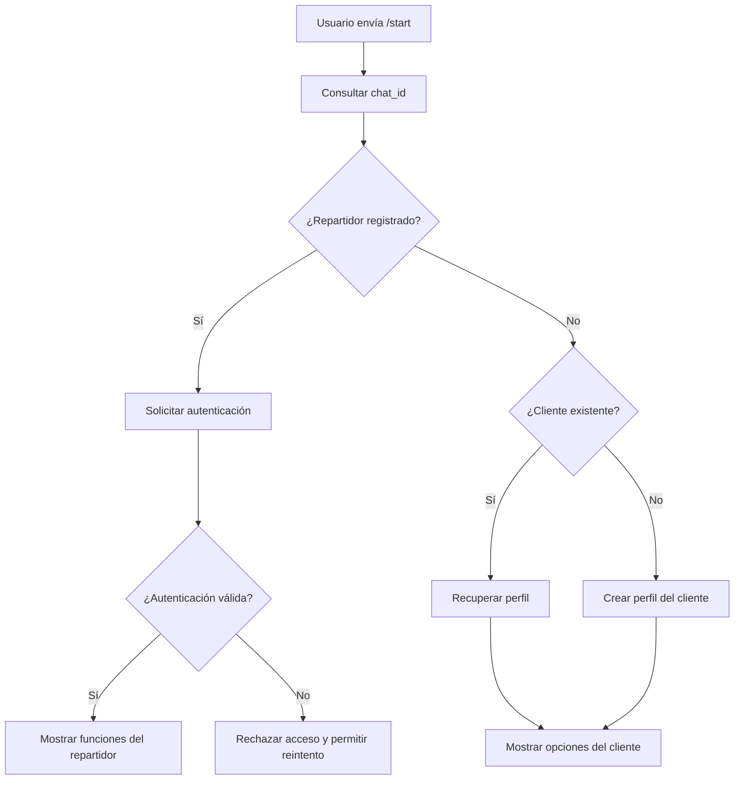
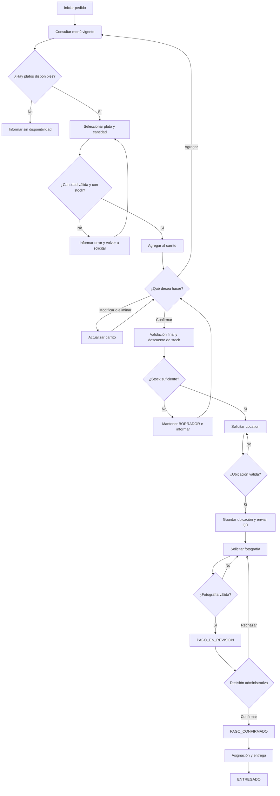
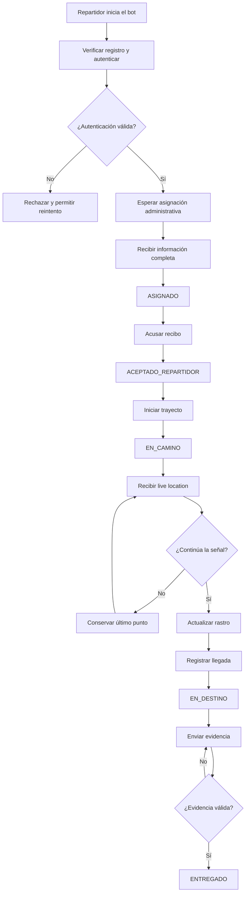

# Flujo conversacional del bot

## Propósito

Este documento describe las conversaciones previstas para el cliente y el
repartidor mediante el bot de Telegram del MVP de Restaurant Las Retamas.
También contempla cancelaciones, reinicios, entradas inesperadas, eventos
repetidos y notificaciones automáticas.

El flujo se basa en las historias de `docs/requisitos.md` y en la máquina de
estados definida en `docs/estados-pedido.md`. No representa una funcionalidad ya
implementada.

## Inicio e identificación del usuario

La conversación comienza cuando el usuario envía `/start`. El bot obtiene su
`chat_id`, consulta la base de datos y determina si corresponde a un repartidor
registrado o a un cliente.

### Identificación del cliente

- Si el `chat_id` existe, el bot recupera el perfil persistido.
- Si no existe, crea un perfil de cliente.
- Un mismo `chat_id` no genera perfiles duplicados.
- El cliente puede iniciar un pedido o consultar uno existente.

### Identificación del repartidor

- El bot comprueba que el repartidor esté registrado.
- Solicita el mecanismo de autenticación que se defina para el MVP.
- Solo después de validar la identidad muestra los comandos del rol.
- Una autenticación inválida no concede acceso y permite reintentar.
- El repartidor no consulta una cola: solo recibe pedidos asignados desde el
  panel.

### Mensaje inicial fuera de contexto

Un mensaje que no inicia una operación válida recibe una respuesta comprensible
con las opciones disponibles. La respuesta no crea pedidos ni altera un flujo
activo.

## Flujo del cliente

### Inicio de un pedido

Al elegir iniciar un pedido, el bot crea o recupera un carrito en estado
`BORRADOR`. Si ya existe un borrador activo, ofrece continuarlo o reiniciar su
contenido. El reinicio del borrador no modifica pedidos previamente confirmados.

### Consulta del menú

El bot consulta la base de datos y aplica estas reglas:

- incluye únicamente platos habilitados para la fecha actual;
- excluye platos con stock igual a cero;
- muestra nombre y precio;
- utiliza `InlineKeyboardMarkup` para las opciones;
- no mantiene platos escritos directamente en el código.

Si no existen platos disponibles, informa la situación, no permite avanzar a la
confirmación y ofrece consultar nuevamente.

### Selección de platos y cantidades

Cuando el cliente pulsa un plato:

1. el bot solicita la cantidad;
2. valida que sea un número entero mayor a cero;
3. consulta el stock disponible;
4. si la cantidad es válida, agrega o actualiza el plato;
5. si supera el stock, informa la disponibilidad;
6. permite volver al menú o revisar el carrito.

Una doble pulsación no debe agregar dos veces el mismo efecto.

### Administración del carrito

El carrito muestra:

- plato;
- cantidad;
- precio unitario;
- subtotal;
- total general.

El cliente puede agregar otro plato, modificar una cantidad, eliminar un
producto, vaciar el carrito, confirmar o cancelar. Cada modificación vuelve a
validar la cantidad y recalcula el total. Un carrito vacío no puede confirmarse.

### Confirmación y stock

Al confirmar el carrito:

1. se valida nuevamente la disponibilidad de todos los platos;
2. la validación y el descuento de stock se realizan como una sola operación;
3. si falta stock, el pedido permanece en `BORRADOR`;
4. si todo es válido, pasa a `PENDIENTE_UBICACION`;
5. se genera el código de seguimiento;
6. repetir el evento no vuelve a descontar stock.

### Ubicación de entrega

El bot solicita una ubicación nativa de Telegram. El cliente debe enviar un
objeto `Location`; se almacenan la latitud y longitud asociadas al pedido y la
ubicación queda disponible para el panel.

Después de guardar una ubicación válida, el pedido pasa a
`PENDIENTE_COMPROBANTE`. Si se recibe texto, una fotografía u otro contenido, el
estado no cambia y el bot explica cómo compartir la ubicación.

### QR y comprobante

Después de registrar la ubicación:

1. el bot envía el QR mediante `sendPhoto`;
2. solicita una fotografía del comprobante;
3. rechaza otros tipos de contenido sin perder el contexto;
4. almacena la fotografía válida y la asocia al pedido;
5. cambia el estado a `PAGO_EN_REVISION`;
6. informa que la revisión será manual.

Recibir el comprobante no marca automáticamente el pedido como pagado.

### Revisión manual del pago

Desde el panel, el administrador visualiza el comprobante y decide confirmarlo o
rechazarlo.

Si lo confirma:

- el pedido pasa a `PAGO_CONFIRMADO`;
- se registra la acción administrativa;
- el bot notifica al cliente.

Si lo rechaza:

- vuelve a `PENDIENTE_COMPROBANTE`;
- el bot solicita una nueva fotografía;
- se conserva el historial;
- no se crea otro pedido.

### Seguimiento del pedido

El cliente puede consultar el pedido mediante su código de seguimiento. El
estado mostrado debe coincidir con la base de datos y el panel. El bot envía
notificaciones ante los eventos relevantes del pago y la entrega.

Un cliente solo puede consultar pedidos asociados con su propio perfil.

### Diagrama del cliente

## Cancelación y reinicio del cliente

### Comando `/cancelar`

El cliente puede cancelar automáticamente desde:

- `BORRADOR`;
- `PENDIENTE_UBICACION`;
- `PENDIENTE_COMPROBANTE`;
- `PAGO_EN_REVISION`.

Al cancelar, el pedido pasa a `CANCELADO`, se registra el evento y se repone el
stock una sola vez si ya había sido descontado.

Después de `PAGO_CONFIRMADO`, `/cancelar` no modifica el estado y el bot informa
que el pedido ya avanzó. No se permite otra cancelación desde `ENTREGADO` o
`CANCELADO`, ni se promete una devolución automática.

### Reinicio

El reinicio limpia el contexto conversacional temporal, pero no elimina pedidos
confirmados ni duplica perfiles. Después permite comenzar un nuevo borrador.

## Entradas inválidas y eventos repetidos

| Situación | Respuesta prevista |
|---|---|
| Texto cuando se espera una cantidad | Explicar el formato y volver a solicitar |
| Cantidad cero, negativa o no numérica | Rechazar sin modificar el carrito |
| Texto cuando se espera `Location` | Explicar cómo compartir la ubicación |
| Archivo cuando se espera fotografía | Solicitar nuevamente el comprobante |
| Mensaje fuera de contexto | Mostrar opciones válidas |
| Botón pulsado dos veces | Procesar el efecto una sola vez |
| Confirmación repetida | Conservar pedido y stock sin duplicar |
| Actualización de Telegram repetida | Reconocer que ya fue procesada |
| `/cancelar` sin flujo activo | Informar que no existe un pedido activo |
| Reinicio durante un pedido confirmado | Limpiar la conversación sin borrar el pedido |

Las respuestas inválidas conservan el último contexto válido y no hacen caer el
bot.

## Flujo del repartidor

### Autenticación

El repartidor inicia el bot, el sistema verifica su registro y solicita el
mecanismo de autenticación. Solo una validación correcta habilita las funciones
del rol. Un cliente o usuario no autorizado no puede acceder a pedidos
asignados.

### Recepción de una asignación

La asignación nace en el panel administrativo. El bot envía al repartidor:

- número del pedido;
- platos y cantidades;
- importe total;
- estado del pago;
- dirección y referencia;
- destino como objeto `Location`;
- nombre del cliente;
- contacto del cliente;
- botón de acuse de recibo.

El pedido queda en `ASIGNADO`.

### Acuse de recibo

Al pulsar el botón, el sistema comprueba que la asignación siga vigente, registra
fecha y hora y refleja el resultado en el panel. El pedido pasa a
`ACEPTADO_REPARTIDOR`. Una doble pulsación no crea otro acuse.

### Inicio del trayecto

El repartidor inicia el trayecto y el pedido pasa a `EN_CAMINO`. El bot solicita
compartir `live location` y el cliente recibe una notificación diferenciada.

### Ubicación en tiempo real

Cada actualización válida almacena:

- pedido;
- asignación;
- repartidor;
- latitud;
- longitud;
- marca temporal.

El intervalo concreto se definirá antes de implementar el seguimiento.

### Pérdida de señal

Si dejan de llegar actualizaciones:

- el pedido permanece en `EN_CAMINO`;
- se conserva la última ubicación y su hora;
- el panel puede indicar que el punto está desactualizado;
- no se registra automáticamente llegada o entrega.

Cuando se recupera la señal, el rastro continúa en la misma asignación y no se
duplican puntos.

### Llegada

Solo el repartidor asignado puede registrar la llegada. El pedido pasa a
`EN_DESTINO`, se guarda la fecha y hora, el panel refleja el evento y el cliente
recibe una notificación.

### Entrega

El repartidor confirma la entrega y debe adjuntar una fotografía o ingresar el
código proporcionado por el cliente. Sin evidencia válida, el estado no cambia.

Con evidencia válida, el pedido pasa a `ENTREGADO`, se registra la fecha y hora,
el cliente recibe la notificación final y la asignación deja de estar activa.

### Diagrama del repartidor

## Reasignación

La reasignación puede iniciarse desde el panel cuando el pedido está
`ASIGNADO`, `ACEPTADO_REPARTIDOR` o `EN_CAMINO`.

El flujo es:

1. el administrador selecciona otro repartidor;
2. se cierra la asignación anterior;
3. el repartidor anterior pierde acceso operativo;
4. el nuevo repartidor recibe la información completa;
5. el pedido vuelve a `ASIGNADO`;
6. se exige un nuevo acuse;
7. los rastros permanecen separados;
8. no se duplica el pedido ni se modifica nuevamente el stock.

Una ubicación, llegada o entrega remitida por el repartidor anterior después de
la reasignación se rechaza.

## Relación entre conversación y estados

| Interacción | Estado resultante |
|---|---|
| Iniciar carrito | `BORRADOR` |
| Confirmar carrito | `PENDIENTE_UBICACION` |
| Enviar ubicación | `PENDIENTE_COMPROBANTE` |
| Enviar comprobante | `PAGO_EN_REVISION` |
| Confirmar pago desde el panel | `PAGO_CONFIRMADO` |
| Asignar repartidor | `ASIGNADO` |
| Acusar recibo | `ACEPTADO_REPARTIDOR` |
| Iniciar trayecto | `EN_CAMINO` |
| Registrar llegada | `EN_DESTINO` |
| Confirmar entrega con evidencia | `ENTREGADO` |
| Cancelar válidamente | `CANCELADO` |

## Notificaciones al cliente

| Evento | Notificación prevista |
|---|---|
| Pedido confirmado | Código de seguimiento |
| Comprobante recibido | Pago pendiente de revisión |
| Pago confirmado | Pago verificado |
| Comprobante rechazado | Solicitud de nueva fotografía |
| Trayecto iniciado | Pedido en camino |
| Llegada registrada | Repartidor en el destino |
| Entrega confirmada | Pedido entregado |
| Cancelación | Pedido cancelado |

## Límites del documento

Este flujo:

- no define nombres de handlers, clases o módulos;
- no establece la estructura de las tablas;
- no fija todavía el intervalo que determina la pérdida de señal;
- no presenta el bot como implementado;
- no describe procesos internos no comprobados del restaurante;
- deberá actualizarse si una implementación aprobada modifica alguna
  interacción.
